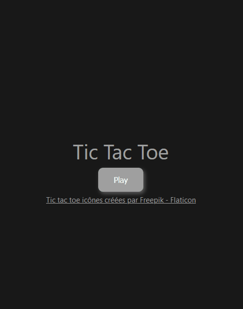

# Tic-Tac-Toe en Vue.js

Bienvenue dans mon projet Tic-Tac-Toe en Vue.js ! Ce projet implémente le jeu classique du Tic-Tac-Toe en utilisant le framework Vue.js.

## Aperçu



## Flaticon

Favicon [Tic tac toe créées par Freepik](https://www.flaticon.com/fr/icones-gratuites/tic-tac-toe)

## Installation

1. Clonez ce dépôt de code sur votre machine locale.
2. Accédez au répertoire du projet via la ligne de commande.
3. Exécutez la commande suivante pour installer les dépendances :

```bash
npm install
```

## Utilisation

1. Assurez-vous d'être dans le répertoire du projet via la ligne de commande.
2. Exécutez la commande suivante pour lancer l'application :

```bash
npm run dev
```

3. Ouvrez votre navigateur et accédez à l'URL suivante : `http://localhost:3000` (ou un autre port si celui-ci est déjà utilisé).

## Licence

Ce projet est sous licence [CeCILL](LICENSE).

---

Amusez-vous bien à jouer au Tic-Tac-Toe !
